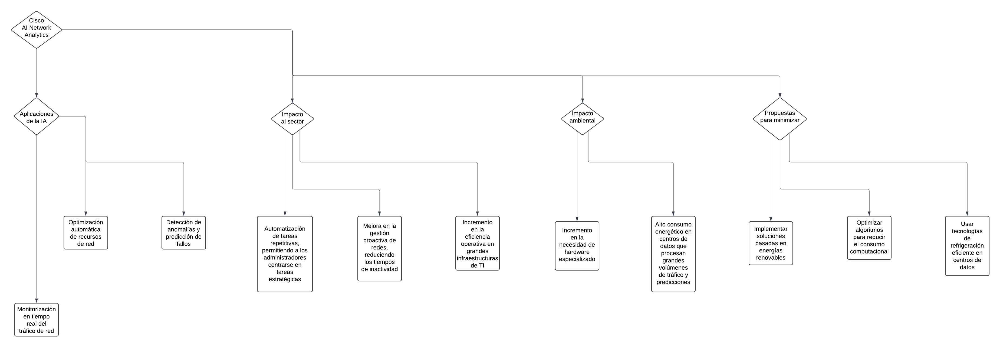
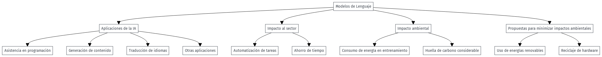

# TA05-ReyesManuel-AlaezMario-GarciaNayra-MartinSilvia

# Índice
- [IAs para desenvolupar](#ias-para-desenvolupadores)
  - [Amazon Q Developer](#amazon-q-developer)
  - [Diffblue Cover](#diffblue-cover)
  - [Tabnine](#tabnine)
    
- [IAs para la gestión de la seguridad](#ias-para-la-gestión-de-la-seguridad)
  - [IBM QRadar](#ibm-qradar)
  - [Clearview AI](#clearview-ai)
  - [Palo Alto Networks Cortex XDR](#palo-alto-networks-cortex-xdr) 
    
- [IAs para analisis de datos](#ias-para-analisis-de-datos)
  - [TensorFlow](#tensorflow)
  - [PyTorch](#pytorch)
  - [H20 ai](#h20-ai)
    
- [IAs para redes](#ias-para-redes)
  - [Cisco IA Network Analytics](#cisco-ai-network-analytics)
  - [Juniper Mist AI](#juniper-mist-ai)
  - [Darktrace Cyber AI](#darktrace-cyber-ai)
    
- [IAs para soporte tecnico](#ias-para-soporte-tecnico)
  - [Modelos de Lenguaje](#modelos-de-lenguaje)
  - [Help Scout](#help-scout)
  - [Tidio](#tidio)

- [Como publicar en GitHub Pages](#como-publicar-en-github-pages)

## IAs para desenvolupadores
1. Amazon Q Developer
2. Diffblue Cover
3. Tabnine

### Amazon Q Developer

- **Aplicaciones de la IA:**
  - Sugerencias de codigo: Genera sugerencias de codigo a tiempo real basado en tus comentarios y en el codigo ya existente.
  - Soporte en CLI: Permite autocompletar comandos de bash, lo cual de por si ya es extremadamente util pero esque tambien traduce el lenguaje natural a bash.
  - Analisis de codigo: No solo puede sugerir codigo sino que puede optimizarlo y analizar vulnerabilidades.
- **Impacto al sector:**
  - Positivo: Aumenta la eficiencia y la seguridad del codigo ademas de permitir trabajar mucho mas rapido
  - Negativo: Ninguno aparentemente.
- **Impacto ambiental:**
  - Consumo de energia, el consumo de energia excesivo de estas herramientas afecta negativamente al cambio climatico.
  - Produccion de hardware, la fabricacion de chips y servidores de alta gama para mantener este tipo de herramientas puede afectar considerablemente al medio ambiente.    
- **Propuestas para minimizar:**
  - Como siempre una de las mejores soluciones y de las mas viables a la vez es el uso de energias renovables, de esta forma evitamos contaminar con toda esa energia.
  - Promover el reciclaje con los dispositivos de red y servidores.
  - Entrenamiento en entornos más eficientes energéticamente.
  - Uso de servidores compartidos en lugar de dedicados para disminuir el impacto.
  - Reducción del tamaño de los modelos de detección sin comprometer la precisión.
  
### Diffblue Cover
- **Aplicaciones de la IA:**
  - Diffblue Cover puede escribir pruebas unitarias de manera autónoma, ahorrando tiempo a los desarrolladores y aumentando la cobertura de pruebas.
  - Las pruebas unitarias generadas describen el comportamiento de cada método, lo que ayuda a documentar el código y facilita futuros cambios.
  - Puede integrarse en pipelines de CI para automatizar la generación y mantenimiento de pruebas unitarias.
- **Impacto al sector:**
  - **Capacitación y formación:** Los desarrolladores pueden aprender de las pruebas generadas por Diffblue Cover, mejorando sus habilidades y conocimientos en la creación de pruebas.
  - **Incremento en la calidad del software:** Con pruebas unitarias generadas automáticamente, se incrementa la cobertura de pruebas, lo que reduce la cantidad de errores y fallos en el software final. Esto resulta en productos más robustos y confiables.
  - Al automatizar la creación y mantenimiento de pruebas, los desarrolladores pueden liberar tiempo para centrarse en la implementación de nuevas características y mejoras, acelerando así el ciclo de desarrollo.
- **Impacto ambiental:**
  - Al automatizar la generación y mantenimiento de pruebas unitarias, se reduce la necesidad de recursos computacionales intensivos que se requerirían para pruebas manuales repetitivas.
  - La automatización de pruebas puede reducir la demanda de trabajo humano en el desarrollo y mantenimiento de pruebas unitarias, lo que podría afectar a profesionales en este campo.
  - A medida que las empresas confían más en la automatización y la inteligencia artificial, pueden volverse dependientes de estas tecnologías, lo que puede limitar la flexibilidad y capacidad de respuesta ante cambios imprevistos.
- **Propuestas para minimizar:**
  - **Reentrenamiento y Capacitación:** Proveer programas de reentrenamiento y capacitación para profesionales cuyo trabajo podría ser afectado por la automatización. Esto les permite adquirir nuevas habilidades y adaptarse.
  - Desarrollar y utilizar algoritmos más eficientes que consuman menos energía, y aprovechar la computación en la nube con infraestructuras verdes y sostenibles.
  - **Inversión en Energías Renovables:** Si el proceso requiere un uso significativo de energía, invertir en fuentes de energía renovable puede compensar el impacto ambiental.
  - **Diversificación de Herramientas:** No depender exclusivamente de una sola herramienta de automatización. Usar una combinación de herramientas y técnicas que ofrezcan flexibilidad y reduzcan la dependencia tecnológica.
  
### **Tabnine**
- **Aplicaciones de la IA:**
  - Completación de Código Impulsada por IA
  - Soporte Multilenguaje y de IDE
  - Enfoque en Privacidad y Seguridad
  - Aprendizaje Personalizado
- **Impacto al sector:**
  - Ayuda a los desarrolladores a escribir código más rápido
  - Asiste a los nuevos desarrolladores en la comprensión y adherencia a los estándares y prácticas de codificación del equipo.
  - Apoya a los desarrolladores que trabajan con múltiples lenguajes de programación al proporcionar sugerencias relevantes a través de diferentes sintaxis.
- **Impacto ambiental:**
  - Alto consumo energético debido debido a la infraestructura que utilizan los centros de procesamiento. 
  - El entrenamiento de un único modelo generativo de IA contiene un alto consumo de agua.
- **Propuestas para minimizar:**
  - Optimizar los modelos para que consuman menos energía durante el entrenamiento.
  - Utilizar hardware especifico para las IA.
  
---
 
## IAs para la Gestión de la Seguridad
  1. IBM QRadar
  2. Clearview AI
  3. Palo Alto Networks Cortex XDR

### **IBM QRadar**
- **Aplicaciones de la IA:**
  - Detección de amenazas en tiempo real mediante el análisis de datos de múltiples fuentes.
  - Correlación automática de eventos de seguridad para identificar incidentes críticos.
  - Priorización de alertas para una respuesta más rápida y efectiva.
- **Impacto al sector:**
  - Mejora significativa en la detección de amenazas avanzadas, como ataques persistentes avanzados (*APTs*).
  - Reducción de la carga de trabajo de los equipos de seguridad, al automatizar la gestión de alertas.
  - Aumento de la precisión en la identificación de incidentes críticos, minimizando falsos positivos.
- **Impacto ambiental:**
  - Uso intensivo de centros de datos para el análisis continuo de datos.
  - Incremento en el consumo energético debido al procesamiento de grandes volúmenes de eventos de seguridad.
- **Propuestas para minimizar:**
  - Implementar análisis más eficientes energéticamente.
  - Usar centros de datos alimentados con energía renovable.
  - Optimizar algoritmos para reducir el consumo de recursos computacionales.

### **Clearview AI**
- **Aplicaciones de la IA:**
  - Identificación facial en tiempo real para la prevención de delitos.
  - Búsqueda en bases de datos masivas de imágenes para localizar sospechosos.
  - Apoyo en investigaciones mediante la correlación de datos visuales y de redes sociales.
- **Impacto al sector:**
  - Herramienta poderosa para cuerpos de seguridad y fuerzas policiales en investigaciones criminales.
  - Controversia por el uso de datos biométricos y el potencial abuso de la privacidad.
  - Posibilita un acceso más rápido a la identificación de personas involucradas en actividades sospechosas.
- **Impacto ambiental:**
  - Elevado consumo energético para el análisis de grandes volúmenes de imágenes y datos.
  - Dependencia de centros de datos con altas demandas de refrigeración y almacenamiento.
- **Propuestas para minimizar:**
  - Reducir la escala de procesamiento mediante enfoques locales en lugar de centralizados.
  - Implementar técnicas de compresión de datos para optimizar el almacenamiento y análisis.
  - Regular su uso para evitar operaciones innecesarias y minimizar el impacto ético y energético.

### **Palo Alto Networks Cortex XDR**
- **Aplicaciones de la IA:**
  - Detección y respuesta ante incidentes de seguridad mediante análisis de datos en endpoints, redes y servidores.
  - Correlación de eventos de seguridad para identificar patrones de ataque avanzados.
  - Automatización de la remediación de amenazas para mitigar riesgos rápidamente.
- **Impacto al sector:**
  - Acelera la capacidad de respuesta a amenazas al integrar múltiples fuentes de datos en un solo sistema.
  - Disminuye el número de ataques exitosos gracias a la identificación proactiva de vulnerabilidades.
  - Reduce la carga de trabajo de los analistas de seguridad al priorizar amenazas críticas.
- **Impacto ambiental:**
  - Procesamiento intensivo en la nube para analizar grandes cantidades de datos de seguridad.
  - Incremento en el uso de infraestructura tecnológica para el monitoreo continuo.
- **Propuestas para minimizar:**
  - Uso de infraestructuras basadas en energías renovables.
  - Reducción de la dependencia en análisis constantes mediante ajustes a demanda.
  - Optimización del software para minimizar el consumo de recursos computacionales.
 
---
 
## IAs para analisis de datos
1. TensorFlow
2. PyTorch 
3. H20.ai

### TensorFlow
- **Aplicaciones de la IA:**
  - Es fundamental para manejar y analizar grandes volúmenes de datos, lo que es crucial en campos como la bioinformática y la finanza.
  - TensorFlow permite construir y entrenar redes neuronales profundas para tareas como reconocimiento de imágenes, procesamiento de lenguaje natural y análisis de voz.
  - Es útil para predecir tendencias y comportamientos futuros en datos temporales, como el análisis de series temporales financieras o meteorológicas.
- **Impacto al sector:**
  - **Finanzas:** Utilizado para la detección de fraudes, análisis de riesgos y previsión de tendencias del mercado, ayudando a las instituciones financieras a tomar decisiones más informadas.
  - **Automoción:** En el desarrollo de vehículos autónomos, ayudando a procesar y analizar datos de sensores y cámaras en tiempo real para la navegación y la toma de decisiones.
  - **Salud:** En la detección precoz de enfermedades como el cáncer a través de la interpretación de imágenes médicas y análisis de datos clínicos, mejorando significativamente la precisión y rapidez del diagnóstico.
  - **Medios y entretenimiento:** En el reconocimiento de voz y el procesamiento del lenguaje natural para asistentes virtuales, subtitulados automáticos y análisis de sentimientos en redes sociales.
- **Impacto ambiental:**
  - Los modelos de IA, incluidos los entrenados con TensorFlow, requieren una gran cantidad de energía para procesar y analizar datos. Esto puede llevar a un aumento en las emisiones de carbono, especialmente si la energía proviene de combustibles fósiles.
  - La infraestructura necesaria para soportar la IA, como los centros de datos, consume mucha energía y genera residuos electrónicos. Además, estos centros requieren grandes cantidades de agua para enfriar los servidores.
  - La fabricación de hardware para IA depende de minerales críticos y elementos raros, cuya extracción puede ser insostenible y perjudicial para el medio ambiente.
- **Propuestas para minimizar:**
  - **Localización y climatización de centros de datos:** Ubicar los centros de datos en regiones con climas fríos para reducir la necesidad de refrigeración. Implementar sistemas de refrigeración más eficientes para disminuir el uso de agua y energía.
  - **Eficiencia energética:** Optimizar los algoritmos y modelos para que consuman menos energía durante el entrenamiento y la inferencia. Utilizar hardware más eficiente energéticamente, como los chips diseñados específicamente para IA.
  - Alimentar los centros de datos con energías renovables como la solar, eólica o hidroeléctrica. Esto reduce la huella de carbono asociada con el consumo de energía.
  
### PyTorch

- **Aplicaciones de la IA:**
  - PyTorch se utiliza para construir y entrenar modelos de redes neuronales profundas, incluyendo redes convolucionales y recurrentes, ideales para tareas de visión por computadora y procesamiento de lenguaje natural.
  - Es fundamental para tareas de NLP como la traducción automática, análisis de sentimientos y generación de texto.
  - Permite analizar grandes volúmenes de datos y construir modelos predictivos, útil en sectores como finanzas, salud y marketing.
  - PyTorch se aplica en sistemas de aprendizaje por refuerzo, utilizados en robótica, videojuegos y sistemas de recomendación.
- **Impacto al sector:**
  - **Investigación en IA**: PyTorch es ampliamente utilizado por la comunidad investigadora por su facilidad de uso y flexibilidad. Esto ha acelerado el desarrollo de nuevas técnicas y modelos de inteligencia artificial.
  - **Educación:** Es una herramienta popular en el ámbito académico para enseñar conceptos de aprendizaje automático y redes neuronales debido a su interfaz intuitiva y su soporte extensivo.
  - **Manufactura:** En la optimización de procesos industriales mediante el análisis de datos y el aprendizaje automático, mejorando la eficiencia y reduciendo costos.
  - **Automoción:** PyTorch se utiliza en el desarrollo de vehículos autónomos y sistemas avanzados de asistencia al conductor, mejorando la seguridad y la eficiencia del transporte.
  - **Agricultura Sostenible:** La IA puede analizar datos sobre el clima, el suelo y los cultivos para ayudar a los agricultores a utilizar menos agua y pesticidas, promoviendo prácticas agrícolas más sostenibles
- **Impacto ambiental:**
  - Ocurre lo mismo que otras IA, para mantener la infraestructura hace falta de una buena cantidad de agua y energia para poder enfriar los servidores.
  - La fabricación, el mantenimiento y el enfriamiento de los equipos utilizados en los centros de datos contribuyen a la huella de carbono.
  - El hardware utilizado para ejecutar modelos de IA puede generar residuos electrónicos, especialmente cuando los dispositivos se desechan sin procesos adecuados de reciclaje.
- **Propuestas para minimizar:**
  - Refrigeración Eficiente: Implementar sistemas de refrigeración avanzados y más eficientes para los centros de datos, y ubicarlos en regiones con climas fríos para reducir el consumo energético.
  - Desarrollo de Modelos Más Pequeños: Crear y utilizar modelos más pequeños y eficientes que requieran menos recursos computacionales sin comprometer la precisión y el rendimiento.
  - Fomentar la conciencia sobre el impacto ambiental de la IA y promover prácticas responsables tanto en el desarrollo como en el uso de estas tecnologías.
  - Diseñar hardware que consuma menos energía para redes Wi-Fi.
  - Promover el reciclaje y reutilización de dispositivos de red.
  - Utilizar tecnologías de bajo consumo en ubicaciones donde la actividad sea intermitente.

### H20 ai
- **Aplicaciones de la IA:**
  - H2O.ai promueve el uso de modelos de código abierto, lo que permite a los usuarios acceder y modificar los algoritmos según sus necesidades específicas.
  - Es altamente escalable y puede manejar grandes volúmenes de datos y modelos complejos, lo que es crucial para aplicaciones empresariales y de investigación.
  - Alta precisión en el procesamiento del lenguaje natural (NLP), lo que lo hace idóneo para chatbots y aplicaciones en dispositivos con recursos limitados
- **Impacto al sector:**
  - **Retail:** Ayuda a las empresas a entender mejor el comportamiento del cliente y optimizar las estrategias de marketing y ventas.
  - **Manufactura:** Optimiza los procesos de producción mediante el análisis de datos y la predicción de fallos en el equipo.
- **Impacto ambiental:**
  - Consume mucha energia y agua para mantener la infraestructura.
  - La fabricación de hardware depende de minerales cuya extracción puede ser perjudicial para el medio ambiente.
  - El hardware necesario puede generar residuos electrónicos si no se recicla adecuadamente.
- **Propuestas para minimizar:**
  - **Reciclaje de Hardware:** Promover la reutilización y el reciclaje de equipos electrónicos.
  - **Optimización de la Infraestructura:** Mejorar la eficiencia de los centros de datos y maximizar el uso de recursos.
  - **Refrigeración Eficiente:** Implementar sistemas de refrigeración avanzados en los centros de datos.
  - Entrenamiento en entornos más eficientes energéticamente.
  - Uso de servidores compartidos en lugar de dedicados para disminuir el impacto.
  - Reducción del tamaño de los modelos de detección sin comprometer la precisión.
 
---
 
## IAs para redes
  1. Cisco AI Network Analytics
  2. Juniper Mist AI
  3. Darktrace Cyber AI
   
### **Cisco AI Network Analytics**

- **Aplicaciones de la IA:**
  - Monitorización en tiempo real del tráfico de red.
  - Detección de anomalías y predicción de fallos.
  - Optimización automática de recursos de red.
- **Impacto al sector:**
  - Mejora en la gestión proactiva de redes, reduciendo los tiempos de inactividad.
  - Automatización de tareas repetitivas, permitiendo a los administradores centrarse en tareas estratégicas.
  - Incremento en la eficiencia operativa en grandes infraestructuras de TI.
- **Impacto ambiental:**
  - Alto consumo energético en centros de datos que procesan grandes volúmenes de tráfico y predicciones.
  - Incremento en la necesidad de hardware especializado.
- **Propuestas para minimizar:**
  - Usar tecnologías de refrigeración eficiente en centros de datos.
  - Optimizar algoritmos para reducir el consumo computacional.
  - Implementar soluciones basadas en energías renovables.

### **Juniper Mist AI**
- **Aplicaciones de la IA:**
  - Gestión automática de redes Wi-Fi para optimizar el rendimiento.
  - Localización de usuarios en interiores mediante análisis de patrones de señal.
  - Análisis predictivo para evitar interrupciones en la conectividad.
- **Impacto al sector:**
  - Experiencia de usuario mejorada gracias a redes más rápidas y estables.
  - Menos carga de trabajo para los equipos de TI, ya que la IA gestiona muchos problemas automáticamente.
  - Facilita la implementación de redes en grandes organizaciones y espacios públicos.
- **Impacto ambiental:**
  - Mayor uso de equipos conectados y procesadores avanzados con alta demanda de energía.
  - Desafíos en la disposición y reciclaje de dispositivos de red.
- **Propuestas para minimizar:**
  - Diseñar hardware que consuma menos energía para redes Wi-Fi.
  - Promover el reciclaje y reutilización de dispositivos de red.
  - Utilizar tecnologías de bajo consumo en ubicaciones donde la actividad sea intermitente.

### **Darktrace Cyber AI**
- **Aplicaciones de la IA:**
  - Detección y respuesta a ciberamenazas en tiempo real.
  - Análisis de comportamiento para identificar actividades sospechosas.
  - Protección automática frente a ataques avanzados como ransomware.
- **Impacto al sector:**
  - Reducción de riesgos y tiempo de respuesta ante incidentes de seguridad.
  - Menor necesidad de intervención humana en el monitoreo constante.
  - Incremento de la confianza en la ciberseguridad de las organizaciones.
- **Impacto ambiental:**
  - Entrenamiento de modelos de IA en datos de amenazas consume mucha energía.
  - Incremento del uso de centros de datos para el análisis en tiempo real.
- **Propuestas para minimizar:**
  - Entrenamiento en entornos más eficientes energéticamente.
  - Uso de servidores compartidos en lugar de dedicados para disminuir el impacto.
  - Reducción del tamaño de los modelos de detección sin comprometer la precisión.
 
 ---

## IAs para soporte tecnico
1. Modelos de Lenguaje
2. Help Scout
3. Tidio

### Modelos de Lenguaje

- **Aplicaciones de la IA:** Puede dar asistencia en una gran variedad de aspectos como la programacion, la generacion de contenido, traduccion de idiomas entre otras.
- **Impacto al sector:** Sin duda los modelos de lenguaje como Chat GPT han tenido un impacto gigantesco en el sector, tareas que antes eran tardias ahora se pueden automatizar y hacer en cuestion de segundos.
- **Impacto ambiental:** Los modelos de lenguaje tienen un impacto ambiental aunque principalmente este viene a causa del entrenamiento, que requiere de grandes capacidades de energia, y por lo tanto deja una huella de carbono considerable. 
- **Propuestas para minimizar impactos ambientales:**  Sin duda la IA es algo que ha venido para quedarse, esto supone una huella de carbono pero quiza con energias renovables y el reciclaje de hardware se puede lograr disminuir el impacto ambiental.

### Help Scout
- **Aplicaciones de la IA:** Help Scout es una web centrada en el soporte tecnico personalizado con una gran variedad de funciones como una bandeja de entrada compartida entre otras cosas, chatear con los clientes entre otras cosas, pero por lo que destaca y el porque lo añado a la lista es por como utiliza una inteligencia artificial personalizada que se adapta a la empresa y de esta forma puede responder preguntas de la empresa en especifico, ademas tambien permite redactar mensajes con un click, ademas de resumir mensajes y pulir los mensajes que se envien destacando las palabras clave.
- **Impacto al sector:** Realmente es una opcion muy buena para cualquier empresa, una IA que pueda acelerar tantisimo el trabajo tendra mucho uso en el futuro, estoy seguro que la gran mayoria usaran IAs de este estilo para maximizar su trabajo.
- **Impacto ambiental:** Al igual que siempre la IA tiene un impacto ambiental, tener esta IA significaria tener un servidor que consume energia constantemente conectado a los servidores de la empresa, esto sumado a que miles de empresas podrian usar aplicaciones como estas provoca que haya un consumo energetico aun mayor.
- **Propuestas para minimizar impactos ambientales:** Como siempre lo mejor seria utilizar energia renovable y centralizar esta clase de servidores para asi evitar el entrenamiento y el consumo extra de energia, pero tambien hay mas cosas importantes como optimizar algoritmos, reciclaje de hardware y monitorear los servidores para que no consuman demasiado.

### Tidio
- **Aplicaciones de la IA:** Tidio, la principal competidora de Help Scout ha demostrado ser mas que eficiente llegano incluso a resolver mas del 70% de las incidencias de las empresas gracias a su IA, tambien es posible enviar correos simples y que la IA maquille el mensaje para que sea mas profesional, Tidio tambien tiene integracion con Shopify y de esta forma puede ofrecer articulos relevantes a los clientes.
- **Impacto al sector:** Pasa lo mismo que con Help Scout, estas IAs de soporte tecnico han venido para quedarse y no dudo en que son el futuro del sector, no por nada hay mas de 300.000 empresas que confian y usan Tidio.
- **Impacto ambiental:** Al igual que en Help Scout estas IAs requieren servidores que consumen energia constantemente, lo cual puede tener un impacto significativo al largo de los años
- **Propuestas para minimizar impactos ambientales:** Como esta IA tiene el mismo proposito y funcionalidades muy parecidas a las de Help Scout todo lo dicho para Help Scout aplica en esta: Eenergias renovables, optimizacion de algoritmos, reciclaje de hardware, centralizar servidores y monitorear los servidores.

---
### Como publicar en GitHub Pages
Para empezar, tenemos que crear un repositorio público con cualquier nombre que le queramos dar, en nuestro caso le pondremos Manual-AI-ASIX. Después, subiremos todos los archivos del código e iremos a la configuración de nuestro repositorio, le daremos click al apartado "pages". Le damos a Sorcue y seleccionaremos el main de nuestro código, tardará unos minutos en generar una URL a nuestra página web. 
